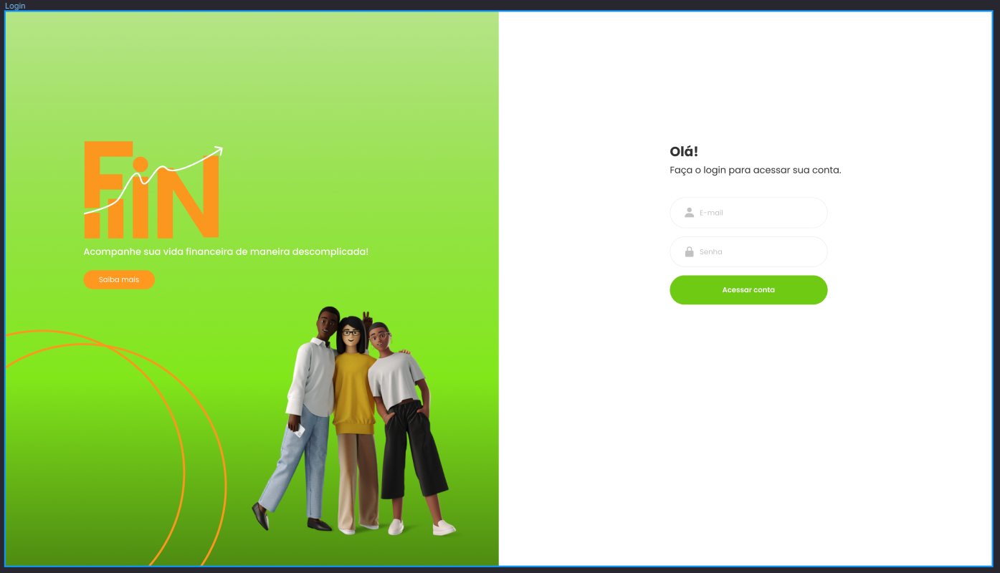
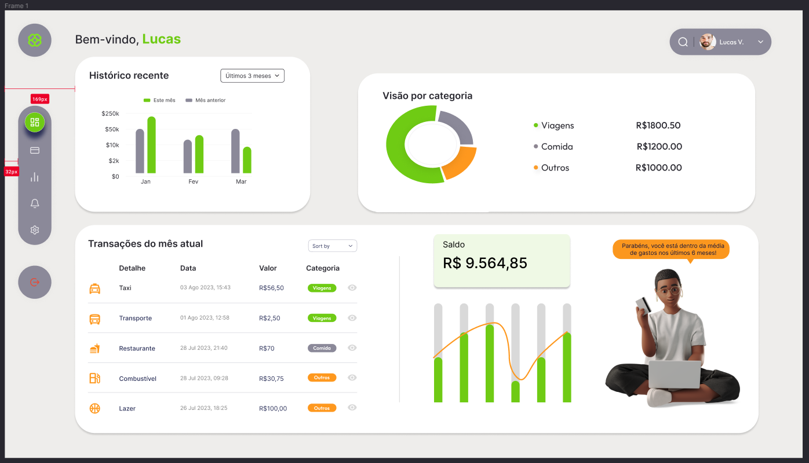
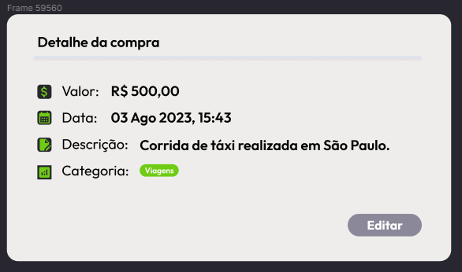

# Um projeto pessoal para consolidar as minhas habilidades em desenvolvimento web.
Descrição do projeto: Um app simples para controlar finanças pessoais.
- Este é o repositório do front-end do projeto.

- Em conjunto com: **Tatiana dos Santos** [( Linkedin )](https://www.linkedin.com/in/tatianadossantos/)
  - Para simular levemente um processo de produção, as telas foram definidas primeiramente no Figma.
  - Tatiana é especialista em UI/UX e fez todo o design do projeto.

---
### Sumário:
1. Links
2. Tecnologias utilizadas
3. Descrição detalhada
4. Figma

---
#### Links:
- [[ Repositório do backend ]](https://github.com/LucasVolkmann/fin-backend)
- [ Url do backend (ainda não implementado) ]
- [[ Repositório do frontend ]](https://github.com/LucasVolkmann/fin-frontend)
- [ Url do frontend (ainda não implementado) ]

---
#### Tecnologias utilizadas:
- Linguagem principal: **TypeScript**
- Lib: **React**
- **Vite**
- UI Lib: **Ant Design**
- **Redux**

---
#### Descrição detalhada:
Este é um app para controle de finança pessoais. Onde cada usuário pode criar uma conta. Cada conta pode adicionar e remover transações. Cada transação tem uma categoria.

---
#### Figma:
- [Link do Projeto](https://www.figma.com/file/208IaPYLyovn7Nx6BhN3Xj/Projeto-Lucas?type=design&node-id=0-1&mode=design&t=xFkeAdnRaoqCbPnK-0)
- Tela de login:
- 
- Tela Principal:
- 
- Popup de Atualização dos dados de uma Transação:
- 

